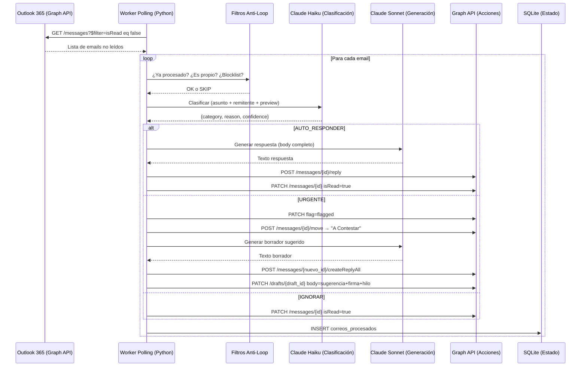

# Arquitectura Maestra — Contestador de Mail

← Volver al [[00_TABLERO_PRINCIPAL|Tablero Principal]]

Este documento es la única fuente de verdad validada para la construcción del **Contestador de Mail**, un agente de IA para la casilla `nicolas.herrera@flexfinetch.com` de FlexFineTech, usando una **Arquitectura de Polling Asíncrono** con integración Microsoft Graph API y Claude AI.

> **Nota MVP:** La arquitectura actual es deliberadamente simple (monolito Python + SQLite + polling) para validar el producto. El vault describe la arquitectura futura SaaS. Ver [[14_ESTADO_MVP_PRODUCCION]] para el estado real.

---

## 1. Visión General del Sistema

El Contestador de Mail procesa emails de Outlook en tiempo real:
- **Clasifica** cada email entrante (AUTO_RESPONDER / URGENTE / IGNORAR) con Claude Haiku
- **Responde automáticamente** los simples con Claude Sonnet
- **Genera borradores** con sugerencias de respuesta para los urgentes (con firma + hilo completo)
- **Organiza** toda la casilla por cliente/proveedor usando análisis de patrones con IA

> **Principio Rector MVP:** Funcional primero, escalable después. Cero dependencias externas innecesarias. Un solo proceso Python puede procesar 25+ emails/corrida sin caídas.

---

## 2. Flujo de Vida del Email (MVP Actual)



---

## 3. Decisiones Tecnológicas Aprobadas (MVP)

| Componente | Tecnología Elegida | Justificación |
|---|---|---|
| Polling / Ingesta | APScheduler + requests (cada 5 min) | Webhooks requieren endpoint público. MVP no tiene servidor. |
| Base de Datos | SQLite (archivo local) | Sin infraestructura extra. Suficiente para single-tenant. Migrar a Postgres en SaaS. |
| Auth Microsoft | MSAL Client Credentials | Admin Consent otorgado. Sin interacción de usuario necesaria. |
| Clasificación IA | Claude Haiku (temperatura=0) | Rápido, económico, determinista. 150 tokens máx. |
| Generación IA | Claude Sonnet (temperatura=0.3) | Mejor calidad para borradores y respuestas. 500 tokens máx. |
| Análisis de Patrones | Claude Sonnet (domain-mapping) | Una sola llamada con remitentes únicos (~45) en vez de 8 batches con todos los emails. |
| Borradores | `createReplyAll` | Incluye todos los destinatarios originales + hilo completo citado. |
| Firma en borradores | GET body → prepend HTML → PATCH | Preserva la firma configurada en Outlook sin replicarla en código. |
| Infraestructura | systemd service (Linux) | Simple, robusto, sin Docker overhead para MVP. |
| Config de clientes | `clientes_contexto.json` | Editable por el usuario sin tocar código Python. |

### A. Ingesta: Polling (MVP) → Webhooks (SaaS futuro)
El MVP usa polling cada 5 minutos vía Graph API (`isRead eq false`). Latencia máxima: 5 min. Para la plataforma SaaS se migrará a Microsoft Graph Change Notifications (webhooks), reduciendo latencia a segundos.

### B. Análisis de Patrones: Domain-Mapping Strategy
**Problema resuelto:** Enviar todos los emails a Claude excedía max_tokens (4000) y causaba rate limiting (8 batches × 429 errors).
**Solución:** Extraer ~45 remitentes únicos → Claude mapea dominios→clientes → asignación de IDs localmente. Una sola llamada API, respuesta de ~500 tokens.

### C. Fallos de IA
Actualmente: try/except con logging. Si Claude falla, el email queda sin procesar (no se marca como leído) y se reintenta en la próxima corrida.
Futuro SaaS: Dead Letter Queue + exponential backoff.

### D. Anti-Loop (5 capas)
1. Dirección propia (`AGENT_MAILBOX`)
2. State DB (IDs procesados en SQLite)
3. Thread awareness (conversation_id ya respondido)
4. Rate limit por remitente (máx N replies/hora)
5. Blocklist de senders ignorados (`IGNORED_SENDERS`)

---

## 4. Estructura de Carpetas de Outlook (Canónica)

```
nicolas.herrera@flexfinetch.com/
├── Bandeja de entrada        ← Inbox principal (el agente lee aquí)
├── A Contestar               ← Emails URGENTES (para respuesta humana)
├── Borradores                ← Borradores generados por el agente
├── Clientes/
│   ├── AbogadosRecovery
│   ├── Edesur                ← También recibe emails de Enel (mismo grupo)
│   ├── GEDCO
│   └── Gerenciar             ← También recibe emails de Theiler (mismo grupo)
├── Internos/
│   └── FlexFineTech
├── Marketing/
│   ├── Aerolineas
│   └── ForumEventos
├── Proveedores/
│   ├── Anthropic             ← También recibe emails de Claude/Azure notifs
│   ├── AWS
│   ├── ElevenLabs
│   ├── GitHub
│   ├── Miro
│   ├── Qlik
│   ├── ReadAI
│   ├── RedHat
│   ├── Snowflake
│   └── TuRecibo
├── Sistemas/
│   └── Notificaciones
└── Externos/
    ├── Gmail
    └── Varios
```

**Regla:** Los aliases de clientes (Enel=Edesur, Theiler=Gerenciar) se configuran en `clientes_contexto.json`, no en el código.

---

## 5. Seguridad

- **Auth:** OAuth 2.0 Client Credentials con MSAL. Token se renueva automáticamente (cache en memoria).
- **Secrets:** Variables de entorno en `.env` (nunca en código). Admin Consent en Azure AD.
- **Anti-Loop:** 5 capas (ver sección 3D). Garantiza que el agente nunca responde sus propios emails.
- **Dry-run:** Todos los pipelines soportan `--dry-run` para validar sin cambios reales.

---

## 6. Requisitos No Funcionales (MVP)

| Requisito | Objetivo | Estado |
|---|---|---|
| Disponibilidad | 24/7 via systemd restart=always | ✅ |
| Latencia de procesamiento | <6 min desde llegada a respuesta | ✅ |
| Trazabilidad | SQLite con todos los emails procesados | ✅ |
| Cobertura de tests | ≥80% | ✅ (80.6% en v1.0) |
| Sin datos duplicados | IDs procesados en SQLite | ✅ |
| Rate limit Graph API | sleep(0.26) entre acciones (≤4 req/seg) | ✅ |

---

## 7. Arquitectura Futura (SaaS — 5 Fases del Vault)

El MVP es un monolito single-tenant. La arquitectura objetivo es:

```
Fase 1 — Búnker:    PostgreSQL + RLS multitenant + Docker
Fase 2 — Oído:      Webhooks Graph/Gmail + Kafka + MinIO
Fase 3 — Cerebro:   Workers distribuidos + RAG + SLA engine
Fase 4 — Estación:  Next.js dashboard + Kanban + copiloto IA
Fase 5 — Blindaje:  CI/CD GitHub Actions + Kubernetes + observabilidad
```

Ver [[10_HOJA_DE_RUTA]] para el detalle de tareas.
